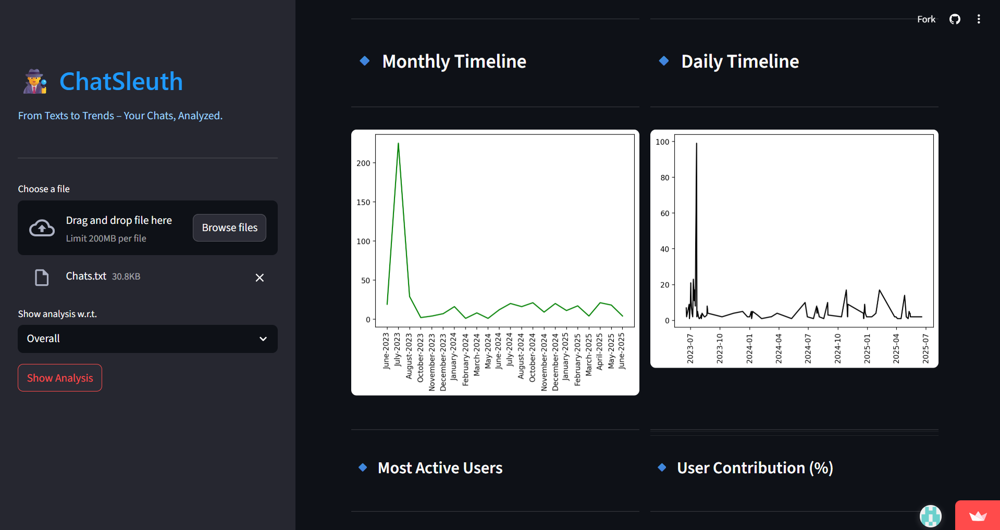

# 🔍 ChatSleuth – Uncover Hidden Patterns in Your Chats

[](https://streamlit.io/)


**ChatSleuth** is a powerful and intuitive chat analysis web app built with **Python** and **Streamlit**. Whether you're curious about your daily activity, top contributors in a group, emoji usage, or frequently used words — ChatSleuth provides **visual and interactive insights** at your fingertips.

Just upload your exported chat file and explore the dynamics of your communication with beautiful charts, heatmaps, and stats!

---

## 🎥 Demo Video

📽️ Click below to watch the full demo hosted on Google Drive:

**👉 [ChatSleuth – Video Demo on Google Drive](https://drive.google.com/file/d/1UiAGc93di1CCgsYFWSVaNFsfZ1ZPRF7m/view)**

---

## 🧩 Features

### 📈 Chat Activity Analysis
- View total messages, media shared, links sent, and word count
- See activity timelines: daily, weekly, and monthly patterns

### 🧑‍🤝‍🧑 User-Level Statistics
- Get a ranked list of top contributors based on message count
- Drill down into individual user stats

### 😄 Emoji & Text Usage
- Emoji usage distribution chart for fun insights
- Word cloud showing frequently used terms
- Most common words and their frequency count

### 🗂️ File Upload System
- Upload chat `.txt` files directly via the browser
- Works with any plain-text formatted chat exports

### 📊 Visualizations & UI
- Clean and interactive dashboard powered by Streamlit
- Uses Matplotlib, Seaborn, WordCloud, and Pandas for visualizations
- Responsive, easy-to-navigate layout

---

## 🖼️ Screenshots

| Dashboard Overview | Word Cloud | Timeline Activity |
|--------------------|----------------|-------------------|
|  |  |  |


---

## 🛠️ How to Use

### 📦 1. Clone the Repository
```bash
git clone https://github.com/your-username/ChatSleuth.git
cd ChatSleuth
